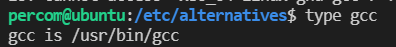
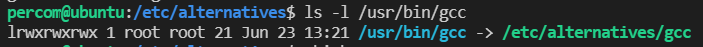
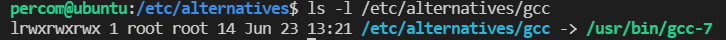
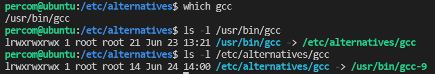

# 多版本控制

一般用apt-get会比较方便安装某些软件，不过apt-get似乎不能在安装之前搜索这个软件一共有哪些版本。

但是可以利用

`apt-cache policy 包名` 来查看即将安装的软件的版本。

然后版本控制的话主要命令是`update-alternatives`

这里以以gcc，g++为例，先讲一下流程，之后再描述一下原理

1.安装gcc和g++

`sudo apt-get install gcc-7 g++-7
sudo apt-get install gcc-4.8 g++-4.8`

在包名后面-版本号可以指定版本，但是这个版本要网上去搜，apt似乎搜索不了。

2.向update-alternatives进行版本注册

`sudo update-alternatives --install /usr/bin/gcc gcc /usr/bin/gcc-7 70 --slave /usr/bin/g++ g++ /usr/bin/g++-7 --slave /usr/bin/gcov gcov /usr/bin/gcov-7`

`sudo update-alternatives --install /usr/bin/gcc gcc /usr/bin/gcc-9 90 --slave /usr/bin/g++ g++ /usr/bin/g++-9 --slave /usr/bin/gcov gcov /usr/bin/gcov-9
sudo update-alternatives --install /usr/bin/gcc gcc /usr/bin/gcc-4.8 48 --slave /usr/bin/g++ g++ /usr/bin/g++-4.8 --slave /usr/bin/gcov gcov /usr/bin/gcov-4.8`

install是一个位置参数，它之后需要跟4个参数-install link name path priority

link表示需要创造的软链接，name表示注册到update-alternatives时的name（之后就会按照name对同一个软件的所有版本进行管理），path表示这个软件的真实路径，priority表示优先级，没啥用。

slave则是基于install的一个衍生参数，也就是说将和gcc配套的g++也统一纳入管理。

slave <link> <name> <path>，用法和install差不多。

3.之后就可以切换版本了

`sudo update-alternatives --config gcc`

### 总结

---

所以从实际上来看的话，`update-alternatives`的功能就是可以切换软件的软链接，那么我们能否利用`update-alternatives`对cuda进行版本控制呢？

这要先看一下的`update-alternatives`实际原理。

我们首先看一下gcc这个命令的被找到时的路径（type,which）

之后跟踪一下这个软链接（ls -l）

我们切换一下版本，再跟踪一下

所以我们可以发现，`update-alternatives`的内层并没有如我们之前想的那么简单，并不是将link指向path就可以了。而是这中间又多了一层，统一将<link>指向/etc/alternatives/<name>，之后只要对/etc/alternatives/<name>的指向进行控制即可，可以根据选择切换指向的<path>。但是从使用者的角度来看，其实两种方法用起来都没有差别。只不过可能对于这个命令来说，直接操作link会比较危险，所以中间加了一层。

所以确实可以用`update-alternatives`对cuda或者其他任意的软件也进行版本控制，因为这个命令并不会影响到环境变量，只是说修改了软链接的指向。

[https://blog.csdn.net/carry_hjr/article/details/102821820](