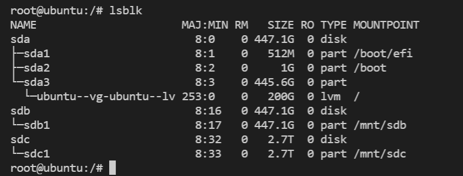
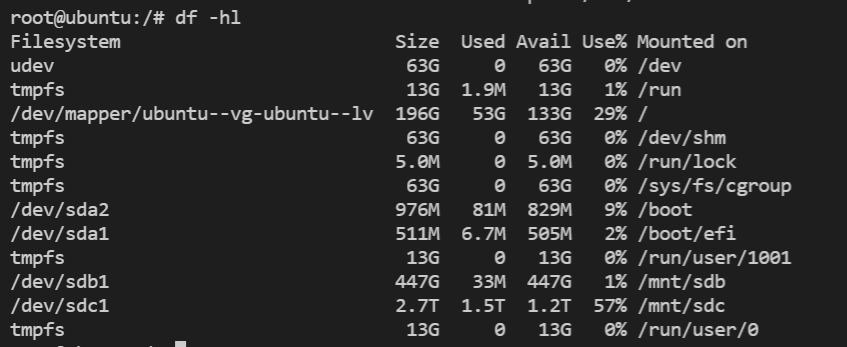
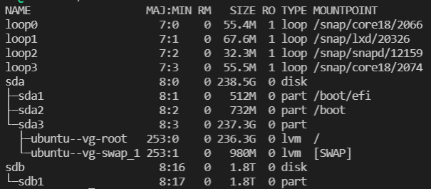
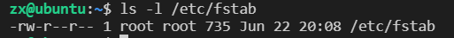
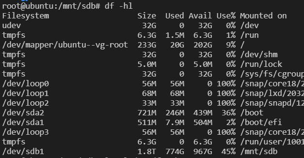
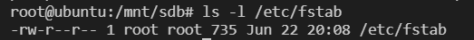
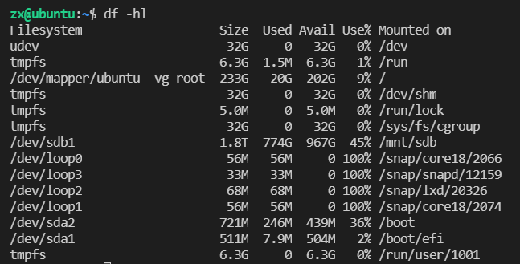
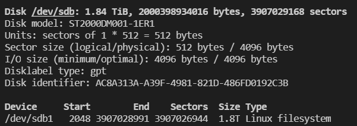
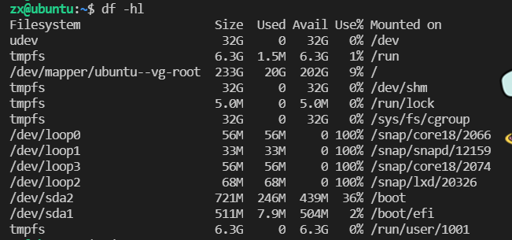

# 硬盘挂载(lsblk,df -hl)

之前一直没试过硬盘挂载，现在发现很简单。不过硬盘挂载也涉及了挺多的知识点。

### 前置知识:

---

首先是一些前置知识：linux中，设备都是是通过文件来表示的。外部设备全部存放在/dev这个文件夹中，那么磁盘也存放在这里。磁盘命名的特点：sda1，sda2,sdb1等等。后面的1,2可能是磁盘分区，但是我目前还不清楚如何对磁盘进行分区。

/etc文件夹则存放配置信息，这里主要介绍一下/etc/fstab。这个文件存放了硬盘挂载的配置信息。我想这可能可以解释为什么单用户模式下，某些硬盘没有被挂载。手动mount的硬盘似乎并不会被记录在这里。但是我现在不是很清楚怎么配置fstab。所以可能重启之后还是需要手动挂载一下，稍微有点麻烦。

然后介绍几个相关的命令：lsblk，fdisk -l，df -hl。

### lsblk:

这个命令可以显示，目前服务器上所有的硬盘信息。方便我们得到相关硬盘的名字。

在这个例子中，我们服务器一共有3个硬盘，分别为sda，sdb，sdc。可以发现sda被分为3个区1,2,3。不过在sda3下似乎又分了一个区，真神奇。sdb和sdc没分区。并且被挂载在/mnt下。

-f可以显示文件系统类型，这个比较好用。

### df -hl:

这个命令可以显示目前已挂载硬盘的情况。

不过linux系统在安装时，似乎会帮我们自动创建一些挂载点，这个就不管了。

Filestystem显示的是设备名。Mouted on显示的是设备的挂载点。

-T可以显示文件系统类型，ext2之类的。

### fdisk -l:

不知道有啥用，看不懂，先放着吧。

### 挂载流程：

mount 设备名 挂载点

例：mount /dev/sdb1 /mnt/sdb

挂载测试：

这个是在227服务器上的测试，首先看一下目前的磁盘信息

那我们把sdb1挂载到mnt上看一下。

可以看到fstab在挂载之后并没有被修改。

之后重启一下

等会儿还要测试一下reboot之后挂载到底会不会消除。

发现挂载点果然没了。所以要找一下怎么添加到fstab。

但是网上查了一下，似乎修改fstab会比较危险，所以还是找一个替代方案吧。

但是在这之前还有几个问题需要解决一下

这里的disklabel type和 type：linux filesystem是什么关系？

[https://blog.csdn.net/choumin/article/details/110862544](https://blog.csdn.net/choumin/article/details/110862544)

gpt似乎是和mbr对应的，是一种磁盘组织方式。这种形式主要是为磁盘分区提供接口。

然后ext2，ft2，他们是建立在gpt和mbr之上的，他们主要为文件处理提供接口，也就是我们使用ext2的接口就可以实现存储、读写文件的功能。

### fstab:

6个字段

1.file system

设备名，/dev/sdb1之类的。

2.dir

挂载点，/mnt/sdb之类的

3.type

文件系统类型，ext4之类的，不过可以直接设置成auto

4.options

一般都填defaults

5.dump

0

6.pass

0

例子：

可以在fstab中添加：

/dev/sdb1 /mnt/sdb auto defaults 0 0

嘿嘿果然可以了。

话说要是设置错了，导致启动不了怎么办呢？

进单用户模式把那行注释掉应该就行了。