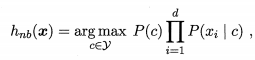
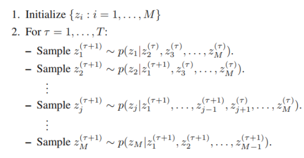

## 极大似然估计

https://zhuanlan.zhihu.com/p/36331115

例题： 试使用极大似然法估算西瓜数据集 3.0 中前 3 个属性的类条件概率.（机器学习周志华7.1）

 

类条件概率: $P(x|c)$

以色泽为例，关于色泽的类条件概率：

$ p_{乌黑|是}=p_{1}$, $ p_{浅白|是}=p_{2}$ , $p_{青绿|是}=p_{3}$ 

似然为：$L(p_{色泽，是}) = P(X_{色泽}|C=是) =\prod_{x\in D_{是}}P(x) = p_{1}^{4}p_{2}^{1}p_3^{3}$

其对数似然为：$ LL(p_{色泽，是})=4ln(p_1)+ln(p_2)+3ln(p_3) $ 

求极大似然，则分别对 $ p_1,p_2,p_3$ 求偏导并使其为零，注意：$p_1+p_2+p_3 = 1$

可求得： $p_1,p_2,p_3$ 的极大似然估计： $ \hat{p_1}=\frac{1}{2},\hat{p_2}=\frac{1}{8} $, $\hat p_{3}=\frac{3}{8} $

同理可得  $ P(X_{色泽}|Y=否) $ 的似然概率，进而求得类为“否”时各取值条件概率的极大似然估计。

值得注意的是，这边的$p_1,p_2,p_3 \dots$就是$\theta_c$的参数值

>  离散值时直接计算各类别的条件概率； 连续值时，是均值和方差，书上的例子就是连续的

## NB

朴素

半朴素：考虑一部分依赖，独依赖：假设每个属性在类别之外最多依赖于一个其他属性，是比较常用的做法。

拉普拉斯修正：避免其他属性携带的信息被训练集中未出现的属性值”抹去“

## 贝叶斯网络

### 有效表达了属性间的条件独立性

### 分析条件独立性的方法

D-separation ：http://web.mit.edu/jmn/www/6.034/d-separation.pdf

### MDL准则确定贝叶斯网

若网络结构己知，即属性间的依赖关系己知，则贝叶斯网的学习过程相对简单，只需通过对训练样本"计数"，估计出每个结点的条件概率表即可。但在现实应用中我们往往并不知晓网络结构。于是，贝叶斯网学习的首要任务就是根据训练数据集来找出结构最"恰当"的贝叶斯网"评分搜索"是求解这一问题的常用办法.

最小化$s(B|D)$ 等价于对参数$\Theta$的极大似然估计。

### 贝叶斯网的推断

#### 吉布斯采样

https://www.youtube.com/watch?v=ER3DDBFzH2g

用条件分布拟合联合分布，多次迭代后（比如T次），最后一次的值就是拟合的结果

##### 基于吉布斯采样的近似推断

https://longaspire.github.io/blog/静态贝叶斯网络/#5-贝叶斯网络的推断

## EM算法

https://zhuanlan.zhihu.com/p/36331115